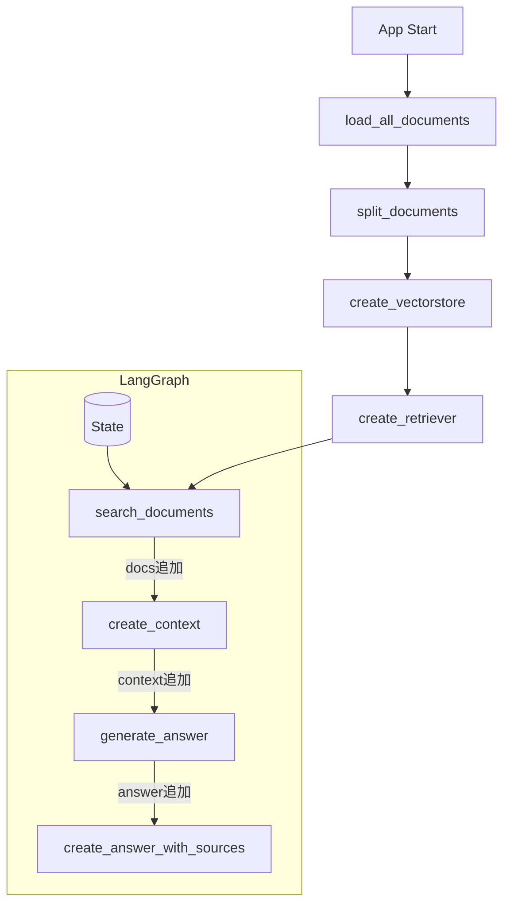
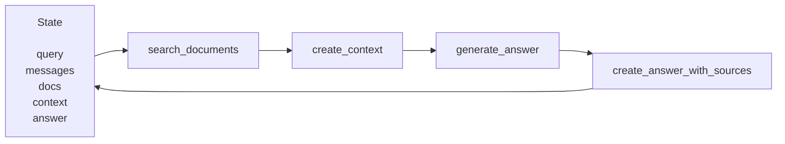

# LangGraph設計図
- 全体図

```mermaid
flowchart TD

Init["App Start"]

A["load_all_documents"]
B["split_documents"]
C["create_vectorstore"]
D["create_retriever"]

Init --> A
A --> B
B --> C
C --> D

subgraph LangGraph

S[(State)]

E["search_documents"]
F["create_context"]
G["generate_answer"]
H["create_answer_with_sources"]

S --> E
E -->|docs追加| F
F -->|context追加| G
G -->|answer追加| H

end

D --> E
```
- stateの状態

```mermaid
flowchart LR

State["State

query
messages
docs
context
answer"]

Retriever["search_documents"]

Context["create_context"]

LLM["generate_answer"]

Sources["create_answer_with_sources"]

State --> Retriever
Retriever --> Context
Context --> LLM
LLM --> Sources
Sources --> State
```
